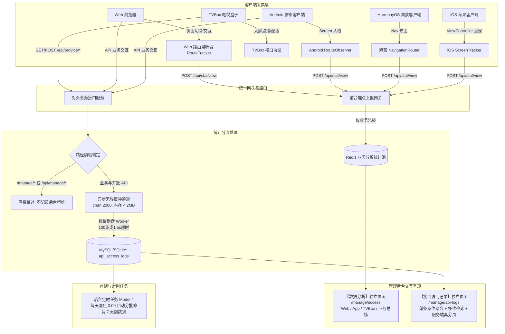

# 数据分析与接口审计体系设计与实现细节方案 (Analytics & API Auditing Architecture)

> **核心宗旨**：
> 1. **业务与运维彻底解耦**：
>    - **【数据分析】(Data Analytics - `/manage/access`)**：专注用户端真实页面流转与交互轨迹，**严禁混入任何底层 HTTP 接口日志、响应耗时或运维错误指标**！
>    - **【接口访问记录】(API Access Logs - `/manage/system?tab=api-logs`)**：收拢至系统设置内，专注全站对外 HTTP 接口调用审计、慢请求分析、错误率追踪与安全回溯。
> 2. **物理锁定资源上限**：
>    - 数据库存储：**7 天滚动时间滑动窗口**，每日后台定时任务分批自动修剪，数据容量物理锁死在天花板（约 20MB~30MB），绝不随时间无限扩涨。
>    - 系统运存：**异步缓冲通道（2000 缓冲，内存 < 2MB）+ 批量聚合落库**，主请求链路零阻塞、零同步写 DB，彻底阻断 OOM。
> 3. **零历史包袱，彻底无需向下兼容 (No Backward Compatibility)**：
>    - **历史访问记录无需迁移**：新业务、新模型与新表（`api_access_logs`）纯增量写入，上线直接按新标准运行，不编写任何历史数据清洗、转换或迁移脚本。
>    - **彻底移除历史兜底逻辑**：废弃历史未分端榜单回退查询与 Redis 旧版全局无分区 Key 的 fallback 查询；Redis 历史老 Key 随固有 TTL（14 天）自然淘汰过期，代码零兼容负担。

---

## 一、 架构分工与模块矩阵

| 模块名称 | 路由入口 | 关注核心 | 数据源 | 核心指标与展示内容 |
| :--- | :--- | :--- | :--- | :--- |
| **数据分析 · Web 终端** | `/manage/access` (Tab 1) | 网站用户交互行为 | Web 路由拦截器上报 (`/api/stat/view`) | 页面 PV/UV、停留深度、浏览器/OS 占比、热门 URL 榜单、100条用户流转常驻流水 |
| **数据分析 · 移动 App** | `/manage/access` (Tab 2) | 移动原生客户端体验 | App 路由拦截器上报 (Android / 鸿蒙 / iOS) | 移动端 PV/UV、Android/HarmonyOS/iOS 平台占比、版本分布、机型 TOP、原生 Screen 足迹 |
| **数据分析 · TVBox 端** | `/manage/access` (Tab 3) | 电视盒子大屏调用 | TVBox 专用解析接口 (`/api/provide/vod`) | 影视点播、寻片搜索、源配置同步、分类浏览占比分布及大屏实时交互流水 |
| **数据分析 · 业务榜** | `/manage/access` 各端内嵌 | 影视消费洞察 | 用户播放/搜索/分类业务埋点 | 点播 TOP 10、搜索热词 TOP 10、高频分类 TOP 10（全站分类 + 分端点播/搜索） |
| **接口访问记录** | `/manage/system?tab=api-logs` (支持 `/manage/api-logs` 自动重定向) | HTTP 接口稳定性与性能 | 全局接口中间件拦截（统一排除 `/manage`） | 今日接口总调用量、4xx/5xx 异常率、慢接口数 (>500ms)、平均耗时、多维筛选与分页流水 |

---

## 二、 业务架构与数据流拓扑



---

## 三、 防数据库与运存无限扩涨架构实现细节

针对“长期运行数据库爆满、内存 OOM 崩溃”的经典隐患，系统从**运存、写入、存储、查询**四个维度物理锁死资源上限：

### 1. 运存防爆：定长非阻塞缓冲通道
- **缓冲通道配置** (`server/internal/access/api_logger.go`)：
  ```go
  const (
      ApiLogQueueCapacity = 2000                  // 缓冲队列硬顶，内存占用严格锁定在 < 2MB
      ApiLogBatchSize     = 100                   // 每次批量写 DB 批量大小
      ApiLogFlushInterval = 1500 * time.Millisecond // 批量写入最大等待超时
      DefaultRetentionDays = 7                   // 滚动时间窗口天数
  )
  var apiLogQueue = make(chan *model.ApiAccessLog, ApiLogQueueCapacity)
  ```
- **非阻塞背压丢弃**：
  ```go
  func EnqueueApiAccessLog(item *model.ApiAccessLog) {
      if item == nil {
          return
      }
      select {
      case apiLogQueue <- item:
      default:
          // 极端突发流量下背压保护：丢弃非关键日志采样，物理阻断 OOM
      }
  }
  ```

### 2. 写入优化：后台 Worker 批量合并刷盘
- **单例 Worker 运行机制**：
  主 HTTP 请求链路仅将数据压入通道，**0 阻塞、0 耗时、0 同步写库**。后台单协程由 `sync.Once` 启动，通过 `context` 支持优雅停机：
  ```go
  func runBatchFlushWorker(ctx context.Context) {
      ticker := time.NewTicker(ApiLogFlushInterval)
      defer ticker.Stop()
      batch := make([]*model.ApiAccessLog, 0, ApiLogBatchSize)

      flush := func() {
          if len(batch) == 0 {
              return
          }
          if db.Mdb != nil {
              ensureApiAccessLogTable()
              if err := db.Mdb.CreateInBatches(batch, ApiLogBatchSize).Error; err != nil {
                  syslog.Errorf("[ApiLogWorker] 批量落库失败: %v", err)
              }
          }
          batch = make([]*model.ApiAccessLog, 0, ApiLogBatchSize)
      }

      for {
          select {
          case <-ctx.Done():
              flush()
              return
          case item := <-apiLogQueue:
              batch = append(batch, item)
              if len(batch) >= ApiLogBatchSize {
                  flush()
              }
          case <-ticker.C:
              flush()
          }
      }
  }
  ```

### 3. 数据库容量防爆：7 天滚动滑动窗口 + 定时修剪
- **容量上限锁定计算**：
  全站日均对外请求按 2 万次估算，7 天总日志量锁定在约 14 万条（磁盘占用仅约 20MB~30MB）。**无论系统运行多少年，数据库数据量保持水平平直，绝不随时间无限扩涨**。
- **分批删除修剪算法** (`server/internal/access/api_logger.go`)：
  ```go
  func PruneExpiredApiLogs(retentionDays int) (int64, error) {
      if retentionDays <= 0 {
          retentionDays = DefaultRetentionDays
      }
      cutoff := time.Now().AddDate(0, 0, -retentionDays)
      if db.Mdb == nil {
          return 0, nil
      }
      ensureApiAccessLogTable()

      var totalDeleted int64
      for {
          // 每次批量删除 5000 条，防止大事务锁表与主从复制延迟
          res := db.Mdb.Where("created_at < ?", cutoff).Limit(5000).Delete(&model.ApiAccessLog{})
          if res.Error != nil {
              return totalDeleted, res.Error
          }
          totalDeleted += res.RowsAffected
          if res.RowsAffected < 5000 {
              break
          }
          time.Sleep(50 * time.Millisecond) // 让出 CPU 与磁盘 IO
      }
      return totalDeleted, nil
  }
  ```

### 4. 查询性能防爆：单条条件聚合与强制分页
- **强制服务端分页**：每页限制 20~100 条，杜绝全表拉取；
- **单条条件聚合 SQL** (`server/internal/access/api_logger.go`)：
  杜绝串行执行 4 次独立的 COUNT/AVG 全表扫描，重构为单条 SQL 一次索引范围扫描计算全部 4 项指标：
  ```go
  type TodayStatsRow struct {
      TotalToday int64   `gorm:"column:total_today"`
      ErrorToday int64   `gorm:"column:error_today"`
      SlowToday  int64   `gorm:"column:slow_today"`
      AvgMsToday float64 `gorm:"column:avg_ms_today"`
  }

  var stats TodayStatsRow
  db.Mdb.Model(&model.ApiAccessLog{}).
      Select(`
          COUNT(*) AS total_today,
          COALESCE(SUM(CASE WHEN status >= 400 THEN 1 ELSE 0 END), 0) AS error_today,
          COALESCE(SUM(CASE WHEN duration_ms > 500 THEN 1 ELSE 0 END), 0) AS slow_today,
          COALESCE(AVG(duration_ms), 0) AS avg_ms_today
      `).
      Where("created_at BETWEEN ? AND ?", todayStart, todayEnd).
      Scan(&stats)
  ```

---

## 四、 埋点协议与客户端自动化采集实现细节

### 1. 统一埋点上报接口 (`POST /api/stat/view`)

#### 1.1 数据契约 (Payload Schema)
```json
{
  "source": "web",                  // 平台标识: "web" | "android" | "harmony" | "ios"
  "action": "browse",               // 行为类别: "browse"(页面访问), "play"(播放), "search"(搜索), "classify"(分类浏览)
  "page": "/play?id=1024",          // 页面标识: Web为URL路径; App为原生Screen名 (如 "PlayDetailScreen")
  "page_title": "庆余年 第二季",      // 可选: 页面中文标题
  "resource": "1024",               // 可选: 关联影视ID/搜索关键字/分类ID
  "app_version": "2.5.4",           // App必填: 客户端版本号
  "device_model": "HUAWEI Mate 60"  // App可选: 设备型号 (Web端自动通过 UA 解析)
}
```

#### 1.2 服务端入参处理与防刷校验 (`server/internal/access/page.go`)
- **客户端 IP 提取与脱敏**：
  提取真实 IP，执行 `IPPreviewAndHash`：前三段明文用于地域与网段识别，末段打码脱敏；同时生成 SHA256 Hash 供 HyperLogLog UV 去重统计；
- **防重复刷量防抖** (`pageTooFastSafety`)：
  相同 IP + 相同页面在 2 秒内的重复上报自动熔断忽略，防止恶意刷 PV。

### 2. 各客户端自动化拦截器集成

#### 2.1 Web 端路由自动拦截器 (`web/src/components/public/RouteTracker.tsx`)
挂载在公共根布局 (`web/src/app/(public)/layout-view/index.tsx`)：
```tsx
"use client";

import { useEffect, useRef } from "react";
import { usePathname, useSearchParams } from "next/navigation";
import { trackPageView } from "@/lib/track-page-view";

export default function WebRouteTracker() {
  const pathname = usePathname();
  const searchParams = useSearchParams();
  const lastUrlRef = useRef("");

  useEffect(() => {
    // 过滤管理后台路由与静态 API
    if (!pathname || pathname.startsWith("/manage") || pathname.startsWith("/api")) {
      return;
    }
    const queryString = searchParams?.toString();
    const currentUrl = queryString ? `${pathname}?${queryString}` : pathname;

    if (currentUrl === lastUrlRef.current) return;
    lastUrlRef.current = currentUrl;

    trackPageView({
      source: "web",
      action: "browse",
      page: currentUrl,
      page_title: typeof document !== "undefined" ? document.title : "",
    });
  }, [pathname, searchParams]);

  return null;
}
```

#### 2.2 Android 端路由拦截 (Flutter / Native)
```dart
class AndroidRouteObserver extends NavigatorObserver {
  void _report(Route<dynamic> route) {
    final pageName = route.settings.name;
    if (pageName != null && pageName.isNotEmpty) {
      HttpStatClient.trackView(
        source: 'android',
        action: 'browse',
        page: pageName,
        appVersion: AppInfo.version,
        deviceModel: DeviceInfo.model,
      );
    }
  }

  @override
  void didPush(Route route, Route? previousRoute) {
    super.didPush(route, previousRoute);
    _report(route);
  }
}
```

#### 2.3 HarmonyOS 鸿蒙端路由拦截 (ArkUI Navigation)
```typescript
NavigationRouter.registerObserver({
  onPageShow(pageInfo: NavPathInfo) {
    StatService.trackView({
      source: 'harmony',
      action: 'browse',
      page: pageInfo.name, // 如 "PlayDetailView"
      appVersion: AppConfig.VERSION_NAME,
      deviceModel: deviceInfo.marketName
    });
  }
});
```

#### 2.4 TVBox 电视端大屏协议解析识别 (`server/internal/access/event.go`)
对 TVBox 请求 `/api/provide/vod` 进行专用解析识别，无需客户端额外埋点代码：
- `ac=detail` -> 判定为影视点播 (`action: "play"`, `resource: id`)；
- `wd=...` -> 判定为寻片搜索 (`action: "search"`, `resource: wd`)；
- `ac=list` -> 判定为分类浏览 (`action: "classify"`)；
- 无参数或仅拉配置 -> 判定为源配置同步 (`action: "config"`)；
- 独立归入 `tvbox` 统计域，生成专属的大屏调用与配置下发走势。

---

## 五、 Redis 键名空间模型与分层存储架构

### 1. Redis 键名空间设计矩阵

| 统计域 (`scope`) | 指标类型 | Redis 数据结构 | Key 命名规范 | 说明与操作指令 |
| :--- | :--- | :--- | :--- | :--- |
| `web` / `app` / `tvbox` | 每日 PV | String (Counter) | `access:{scope}:pv:<YYYYMMDD>` | `INCR` 递增计数 |
| `web` / `app` / `tvbox` | 每日 UV | HyperLogLog | `access:{scope}:uv:<YYYYMMDD>` | `PFADD` 基于 IP+UA Hash 去重 |
| `web` / `app` / `tvbox` | 热门页面 | ZSet | `access:{scope}:top:page:<YYYYMMDD>` | `ZINCRBY`，Score 为访问次数 |
| 全站业务 | 热门点播榜 | ZSet | `access:top:play:<YYYYMMDD>` | `ZINCRBY` 影视 ID |
| 全站业务 | 搜索热词榜 | ZSet | `access:top:search:<YYYYMMDD>` | `ZINCRBY` 搜索词 |
| `app` (按平台) | 平台分布占比 | Hash | `access:app:platforms:<YYYYMMDD>` | `HINCRBY` (android/harmony/ios) |
| `app` (按平台) | 版本分布占比 | Hash | `access:app:versions:<YYYYMMDD>` | `HINCRBY` 版本号 |
| `app` (按平台) | 机型分布占比 | Hash | `access:app:models:<YYYYMMDD>` | `HINCRBY` 设备型号 |
| `web` / `app` / `tvbox` | 实时流转足迹 | List | `access:{scope}:recent:<YYYYMMDD>` | `LPUSH` + `LTRIM 0 99` (保留当日最新 100 条纯净交互足迹，严格按日分区，无旧版全局无分区 Key) |

### 2. 混合查询与历史天回查机制（零回退、零向下兼容）(`server/internal/access/query.go`)
- **当天数据（实时）**：直接从 Redis 各端当日分区结构读取并实时计算；
- **历史数据（归档）**：
  每日凌晨由 `rollup.go` 将前一日的 Redis 指标汇总持久化写入 MySQL `access_daily_stats` 与 `access_daily_top`。查询历史日期时，直接读取 MySQL 对应日期的归档数据。
- **彻底无需向下兼容老数据**：
  - **无旧榜单回退**：历史未拆分的旧榜单不作任何兜底降级读取（如不再回退查询旧的 `play`/`search` 统一榜），新看板分端查不到历史榜单直接返回空，绝不展示口径混乱的老数据；
  - **无 fallbackKey 兜底**：流水查询严格只按当日分区 Key 读取，彻底废弃对旧版无分区 Key（`recent`/`slow`/`error`）的二次 fallback 回退，消除不必要的 Redis 穿透开销；
  - **Redis 旧 Key 自然逐出**：重构前已存在的历史 Redis 键自带 14 天 TTL，任其自然过期逐出，系统不进行物理迁移，也不维护新老数据并存的双写逻辑。

---

## 六、 数据库架构与单一事实来源 (Single Source of Truth)

### 1. 数据模型定义 (`server/internal/model/api_access_log.go`)

```go
type ApiAccessLog struct {
	ID         uint64    `gorm:"primaryKey;autoIncrement" json:"id"`
	CreatedAt  time.Time `gorm:"index:idx_api_log_created;index:idx_api_log_created_status,priority:1;not null" json:"createdAt"`
	Method     string    `gorm:"type:varchar(8);not null" json:"method"`
	Path       string    `gorm:"type:varchar(191);not null;index:idx_api_log_path" json:"path"`
	Query      string    `gorm:"type:varchar(500)" json:"query"`
	Status     int       `gorm:"index:idx_api_log_status;index:idx_api_log_created_status,priority:2;not null" json:"status"`
	DurationMs int64     `gorm:"not null" json:"durationMs"`
	IP         string    `gorm:"type:varchar(45);index:idx_api_log_ip" json:"ip"`
	ClientType string    `gorm:"type:varchar(16)" json:"clientType"`
	UA         string    `gorm:"type:varchar(255)" json:"ua"`
}
```

### 2. 单一事实来源模型迁移规范 (消灭多套 AutoMigrate 重复代码)

- **统一全局模型切片** (`server/internal/model/tables.go`)：
  集中定义 `AllModels = []any{...}`。禁止在空库初始化（`TableInit`）与已有库更新（`AutoMigrate`）中维护两套一模一样的长列表。新增任何数据表或字段，仅需在切片追加一行。
- **启动幂等执行** (`server/internal/service/init_service.go`)：
  ```go
  isNewDatabase := !repository.ExistUserTable()

  // 无论新库初始化还是已有库版本升级，统一执行单一事实来源 AllModels 的幂等迁移
  s.TableInit()

  if isNewDatabase {
      db.Mdb.Exec(fmt.Sprintf("alter table %s auto_Increment = %d", model.TableUser, config.UserIdInitialVal))
  }
  ```
  彻底杜绝因两处列表不同步导致的 `Error 1146: Table doesn't exist` 异常。

### 3. 系统默认任务确定性 ID 与并发原子防重
系统内置计划任务（如 Model 4 接口日志清理）使用**确定性固定的语义常量 ID**，替代随机字符串：
```go
apiLogTask := model.FilmCollectTask{
    Id: "sys_cron_api_log_clean", // 固定常量 ID
    Time: 0, Spec: "0 0 3 * * *",
    Model: 4, State: true, Remark: "自动清理7天前的接口访问记录",
}
```
结合数据库底层 `task_id` 唯一索引（`uniqueIndex`），在多容器或微服务多副本并发启动时，天然具备原子互斥保护，杜绝重复插入多条相同任务。

### 4. 历史数据处理规范：纯增量记录，彻底无需向下兼容 (No Data Migration)

- **老数据无需迁移 (No Migration Needed)**：
  - `api_access_logs` 物理表由 AutoMigrate 初始化创建，仅从上线时刻起异步接收新产生的接口日志。历史未落库的零散日志无需回填，更**严禁编写、执行任何侵入式历史数据迁移或数据洗练脚本**；
  - `access_daily_stats` 历史日汇总行由 AutoMigrate 补充新增分端字段（默认 0），历史行只读保留，不进行数据刷写或格式改写。
- **零兼容负担 (Zero Backward Compatibility)**：
  - 彻底拔除历史未分端榜单、老版无分区 Key 的一切回退分支，避免“老数据逻辑”污染重构后的高内聚代码；
  - 启动阶段不执行历史数据校验或自愈，所有定时任务与分析逻辑统一面向单一事实来源与标准规范演进。

---

## 七、 管理后台 UI 与前端交互设计规范

### 1. 前端目录与组件职责分层

```text
web/src/app/manage/
├── access/                           # 【数据分析】业务模块
│   ├── page.tsx                      # 服务端鉴权入口
│   └── view/                         # 视图实现（单文件 ≤ 500 行）
│       ├── index.tsx                 # 主容器，提供 Tab 胶囊切换与全局日期筛选
│       ├── web-view.tsx              # Web 访问分析视图（流量图、热门页面、OS/浏览器分布、常驻流水）
│       ├── app-view.tsx              # App 访问分析视图（Android/鸿蒙/iOS 三端切换、机型/版本分布、常驻流水）
│       ├── tvbox-view.tsx            # TVBox 访问分析视图（点播/搜索/源配置占比、常驻调用流水）
│       ├── business-rankings.tsx     # 全站影视业务榜单（点播 TOP、搜索热词 TOP、高频分类 TOP）
│       ├── trend-chart.tsx           # 纯 SVG 流量走势折线图组件（接入主题色）
│       ├── donut-chart.tsx           # 纯 SVG 环形分布图组件（接入主题色）
│       ├── types.ts                  # 前端数据契约与接口类型定义
│       └── index.module.less         # CSS Module 样式文件
└── api-logs/                         # 【接口访问记录】独立一级模块
    ├── page.tsx                      # 服务端鉴权入口
    └── view/
        ├── index.tsx                 # 接口审计管理主视图（4大指标卡片、多维组合筛选、展开查看Query/UA、真分页）
        └── index.module.less         # 专属 CSS Module 样式
```

### 2. 品牌主题色变量全面接入
- 严格遵循系统规范，彻底清除写死蓝色（`#1677ff`）硬编码；
- 统一使用 Ant Design 语义 CSS 变量：
  - 高亮主色：`var(--ant-color-primary, #fa8c16)`
  - 浅色背景：`var(--ant-color-primary-bg, #fff7e6)`
  - 边框颜色：`var(--ant-color-primary-border, #ffd591)`
  - 悬浮颜色：`var(--ant-color-primary-hover, #ffc069)`
- 完美自适应亮色（Light）与暗色（Dark）主题模式切换。

### 3. 实时页面流转流水常驻展示规范
- 彻底移除不必要的“展开明细 / 收起明细”切换按钮与折叠状态；
- 流水表格常驻直接渲染，配合自带的关键词搜索框与标准分页器，布局紧凑直接，省去管理员冗余点击。

### 4. 样式隔离与约束
- 单文件行数严格控制在 $\le 500$ 行以内，职责超出时采用子组件目录拆分；
- 样式文件统一使用 CSS Module（`index.module.less`），**严禁使用 `:global` 覆盖破坏组件隔离**。

---

## 八、 改造前后全景对比矩阵

| 对比维度 | 改造前 | 改造后（本次全量重构） |
| :--- | :--- | :--- |
| **功能定位** | 业务访问分析与底层 HTTP 接口日志混在一个页面 | **【数据分析】与【接口访问记录】拆为两个独立一级页面** |
| **内容纯洁度** | 访问分析看板充斥 `/api/index`、耗时直方图、500 报错 | **数据分析看板 100% 纯净用户交互足迹，零底层 API 噪音** |
| **终端覆盖度** | 只有一个模糊的 `app` 标签，无法区分端来源 | **细分 Web 站点、Android、HarmonyOS、iOS 及 TVBox 电视端** |
| **TVBox 电视端** | 无法统计大屏行为，与底层接口混在一起 | **自动化协议解析，独立展现点播、搜索、源配置拉取与大屏足迹** |
| **资源无限扩涨** | 缺乏容量控制机制，长期运行可能撑爆运存与磁盘 | **2000 缓冲队列锁定运存 <2MB，7 天滑动窗口将数据锁死在 30MB 内** |
| **接口审计能力** | 仅能在服务器命令行看 stdout，无后台查询界面 | **独立接口记录页面，支持时间、状态码、慢请求、Path/IP 搜索与展开行** |
| **定时任务集成** | 需人工手动配置清理逻辑 | **系统内置 Model 4 定时日志清理任务，每日凌晨 3 点自动修剪** |
| **数据库查询性能** | 统计今日指标串行触发 4 次独立全表扫描 | **单条 SQL 条件聚合（Conditional Aggregation），一次索引扫描出全部指标** |
| **架构演进成本** | 模型在多处硬编码声明，新增表易漏迁报 1146 错误 | **统一 `AllModels` 单一事实来源，声明式全量幂等自动迁移** |
| **历史兼容与迁移** | 试图编写复杂回退逻辑兼顾旧数据，增加代码复杂度 | **彻底无需向下兼容与数据迁移**：纯增量写入，废除回退兜底，旧 Key 依靠 TTL 自然逐出，代码零兼容负担 |
| **Redis 流水写开销** | 全周期单列表或双写无分区 Key，写放大 2 倍 | **严格按日分区单写** (`recent:<YYYYMMDD>`)，消除写放大与历史脏数据堆积 |
