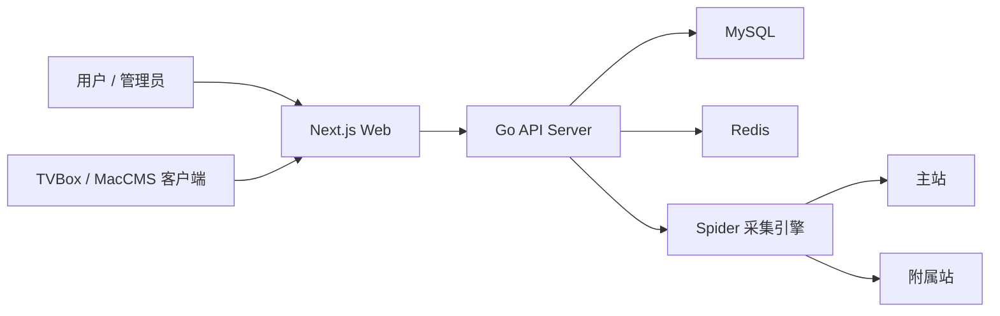
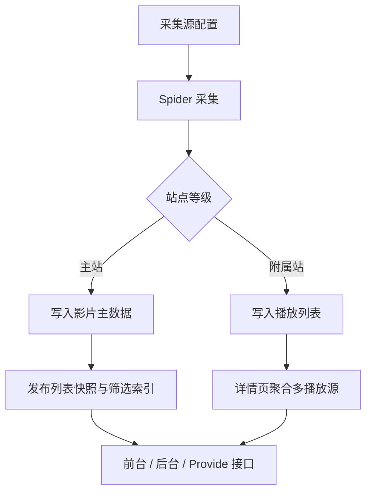

# EcoHub

EcoHub 是一个前后端分离的影视聚合系统。后端负责定时采集、归并、缓存、鉴权和开放接口；前端负责前台站点、登录页和管理后台。

项目仅用于学习和技术交流，不提供影视资源存储。

## 演示入口

- 演示站点：[https://eco.fe-spark.cn](https://eco.fe-spark.cn)
- 管理后台：[https://eco.fe-spark.cn/manage](https://eco.fe-spark.cn/manage)
- 演示访客账号/密码：`guest / guest`

## 项目定位

EcoHub 的核心不是把多个资源站简单平铺入库，而是以“单主站 + 多附属站”的方式归并内容：

- 主站负责影片主数据、检索索引、分类和详情骨架。
- 附属站负责补充播放源，并挂载到主站影片下。
- 内容归并优先使用豆瓣 ID，缺失时使用内容指纹。
- 前台、后台、TVBox / MacCMS 接口共用一致的分类、筛选和排序语义。
- 采集任务完成并发布快照后，入库影片会在前台页面、后台列表和开放接口中可见。
- 后台支持单片更新全部站点，便于补齐多来源播放列表。

## 系统总览



## 核心数据流



## 仓库结构

```text
.
├── server/              # Go API 服务、采集、数据归并、缓存和鉴权
├── web/                 # Next.js 前端、登录页和管理后台
├── deploy/release/      # 发布版 Docker Compose 配置
├── scripts/             # 发布版安装脚本
├── docker-compose.yml   # 源码版 Web / API / MySQL / Redis 容器编排
├── README-Docker.md     # Docker 部署说明
├── README-FAQ.md        # FAQ 与排障
├── server/README.md     # 服务端开发说明
└── web/README.md        # 前端开发说明
```

## 技术栈

| 模块 | 技术 |
| --- | --- |
| Server | Go 1.24、Gin、GORM、MySQL 8、Redis 7、cron、Colly |
| Web | Next.js 16、React 19、TypeScript、Ant Design 6、Axios、Artplayer、Hls.js |
| Deploy | Docker、Docker Compose |

## 快速启动

### 本地开发

1. 准备 MySQL 和 Redis。
2. 启动后端：

```bash
cd server
cp .env.example .env
go run ./cmd/server
```

3. 启动前端：

```bash
cd web
cp .env.example .env.local
npm install
npm run dev
```

4. 默认访问：

- 前台：`http://127.0.0.1:3000`
- 后台：`http://127.0.0.1:3000/manage`
- 后端：`http://127.0.0.1:8080`

详细环境变量和运行说明见：

- [服务端说明](./server/README.md)
- [前端说明](./web/README.md)

### Docker 部署

Docker / GHCR 镜像和 Compose 部署方式见 [Docker 部署说明](./README-Docker.md)。

## 文档导航

| 文档 | 内容 |
| --- | --- |
| [server/README.md](./server/README.md) | 服务端启动、环境变量、采集模型、接口分组、鉴权模型 |
| [web/README.md](./web/README.md) | 前端启动、API 转发、页面结构、鉴权边界 |
| [README-Docker.md](./README-Docker.md) | Docker Compose 部署、外部数据库、内置数据库、持久化建议 |
| [README-FAQ.md](./README-FAQ.md) | 主站机制、缓存、排序、登录态、Docker 常见问题 |

## 默认账号

服务首次启动会补齐内置账号：

| 类型 | 账号 | 密码 | 权限 |
| --- | --- | --- | --- |
| 管理员 | `admin` | `admin` | 可读可写 |
| 访客 | `guest` | `guest` | 只读 |

默认账号只适合初始化和演示。对外部署后请立即修改密码，或替换为你自己的账号体系。

## 开放接口

- MacCMS 兼容查询：`/api/provide/vod`
- TVBox / 影视仓配置：`/api/provide/config`
- App API 基础地址：`/api`

接口细节以服务端路由和 [服务端说明](./server/README.md) 为准。
