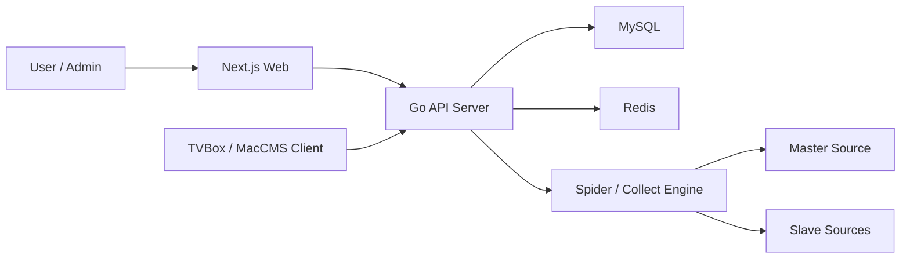
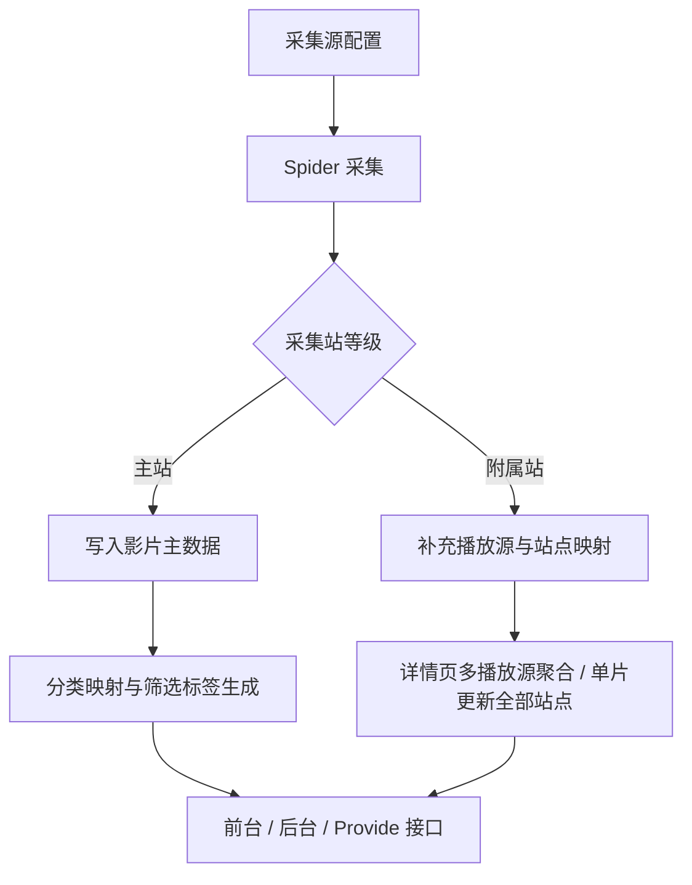
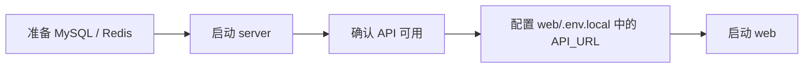
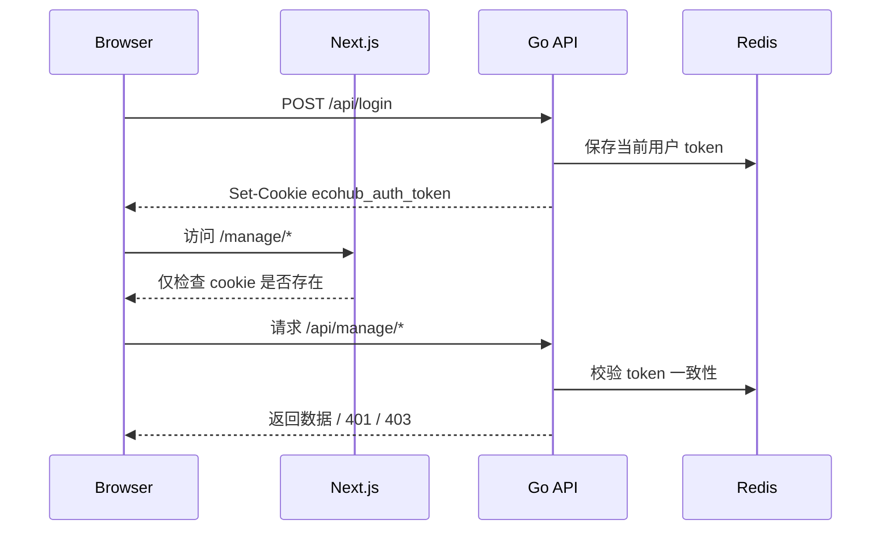

# EcoHub

EcoHub 是一个前后端分离的影视聚合系统：

- `server/`：Go API 服务，负责采集、聚合、缓存、鉴权和对外接口
- `web/`：Next.js 前端，包含前台站点、登录页和管理后台

当前代码的核心逻辑不是“多个资源站平铺入库”，而是“单主站 + 多附属站”：

- 主站负责影片主数据
- 附属站负责补充播放源
- 系统支持后台“单片更新全部站点”
- 内容归并优先使用豆瓣 ID，没有豆瓣 ID 时回退到片名哈希
- 分类优先走源站分类映射，失败时再回退到名称推断
- 主站分类调整、主站切换、初始化后会统一重建前台可见的分类与筛选结果
- 公共分类搜索与 TVBox 接口使用一致的筛选与排序规则

> 项目仅用于学习和技术交流，不提供影视资源存储。

## 演示站

- 演示地址：[https://eco.fe-spark.cn/](https://eco.fe-spark.cn/)
- TVBox / 影视仓接入地址：`https://eco.fe-spark.cn/api/provide/config`
- EcoHub App 接入地址：`https://eco.fe-spark.cn/api`
- 演示站`/manage`后台体验需要使用访客账号登录：账号 `guest`，密码 `guest`

## 系统总览



## 核心数据流



## 仓库结构

```text
.
├── server/              # Go 服务端
├── web/                 # Next.js 前端
├── docker-compose.yml   # Web + API 容器编排
├── README-Docker.md     # Docker 部署说明
├── README-FAQ.md        # FAQ 与排障说明
├── server/README.md     # 服务端说明
└── web/README.md        # 前端说明
```

## 技术栈

### Server

- Go 1.24
- Gin
- GORM
- MySQL 8
- Redis 7
- robfig/cron

### Web

- Next.js 16.1.6
- React 19.2.3
- Ant Design 6
- TypeScript
- Axios
- Artplayer / Hls.js

## 当前实现重点

- 单主站机制：任意时刻仅允许一个主站，主站切换会触发主数据清理与重新归档
- 播放源聚合：列表、搜索、分类只看主站；详情页和播放页从附属站已入库播放列表聚合补源
- 单片更新：后台可以一次触发同一影片在多个站点的数据刷新
- 分类归一：优先使用来源分类映射，失败时再按名称语义兜底
- 统一重建：初始化、主站切换、分类重置后会统一刷新分类、筛选和列表结果
- 筛选能力：剧情、地区、语言、年份都支持“其他”筛选
- 排序规则：最近更新、人气、评分、时间四类排序语义已统一
- 缓存策略：首页、筛选配置和 TVBox 列表都会自动刷新，且只清理项目自身缓存
- 开放接口：`/api/provide/vod` 兼容 MacCMS 查询模式，`/api/provide/config` 输出 TVBox/影视仓配置

## 本地开发

### 1. 启动后端

先准备 `server/.env`：

```bash
cd server
cp .env.example .env
```

按你的环境填写 `PORT`、`JWT_SECRET`、MySQL 和 Redis 连接信息。`JWT_SECRET` 必须使用高强度随机值，可用 `openssl rand -hex 32` 生成。

启动：

```bash
cd server
go run ./cmd/server
```

服务启动时会自动加载当前目录下的 `server/.env`。

### 2. 启动前端

首次运行前先安装依赖：

```bash
cd web
npm install
```

在 `web/` 目录中准备环境变量：

```bash
cd web
cp .env.example .env.local
```

前端开发时重点确认 `web/.env.local` 中的 `API_URL`：

```env
API_URL=http://127.0.0.1:8080
```

如果前后端不在同一台机器，请改成真实可访问地址：

```env
API_URL=http://your-api-origin
```

启动：

```bash
cd web
npm run dev
```

Next 会自动加载 `web/.env.local`。前台入口跟随 Next 开发服务地址，后台固定在 `/manage`，登录页固定在 `/login`。

### 3. 启动顺序



### 4. 内置账号

服务启动时会自动补齐内置账号：

| 类型 | 账号 | 密码 | 权限 |
| --- | --- | --- | --- |
| 管理员 | `admin` | `admin` | 可读可写 |
| 访客 | `guest` | `guest` | 只读 |

演示站后台请使用访客账号登录：账号 `guest`，密码 `guest`。

部署后应立即修改默认口令，或直接替换为你自己的账号体系。

更详细的运行与环境变量说明：

- [服务端说明](./server/README.md)
- [前端说明](./web/README.md)

## 服务器部署

项目自带 `docker-compose.yml`，会启动：

- `web`：Next.js 前端
- `server`：Go API 服务

按部署资源情况分成两种方式：

1. 宿主机或外部环境已经有 MySQL / Redis：修改 `docker-compose.yml` 中 `server.environment` 的连接信息，然后执行 `docker compose up --build -d server web`
2. 宿主机没有 MySQL / Redis：保持 `server.environment.MYSQL_HOST=mysql`、`REDIS_HOST=redis`，再执行 `docker compose up --build -d mysql redis server web`

当前 Compose 可用于服务器部署。是否启用其中的 MySQL 和 Redis，取决于你的部署方式与 `docker-compose.yml` 中的服务配置。

对外访问入口以你的 Compose 端口映射或反向代理配置为准，后台路径仍然是 `/manage`。

当前 Compose 中，前端会在构建期和运行期直接收到 `API_URL=http://server:8080`，不依赖 `web/.env.production`。

当前 Compose 的关键行为：

- `server` 服务运行时环境由 `docker-compose.yml` 直接注入，不读取 `server/.env`
- Compose 默认还会直接注入占位用 `JWT_SECRET`，部署前必须替换为你自己的高强度随机值，可用 `openssl rand -hex 32` 生成
- `web` 服务构建期和运行期都会由 Compose 直接注入 `API_URL=http://server:8080`
- 浏览器端默认通过当前站点下的 `/api/*` 请求，再由 Next rewrite 转发到 `API_URL`
- Compose 默认不把 `server` 直接暴露到宿主机，而是仅供 `web` 通过容器网络访问
- 如果你要启用 Compose 内的 `mysql` / `redis`，需要显式把它们加入启动命令
- 如果你已有外部 MySQL / Redis，需要按你的实际环境自行调整 `docker-compose.yml` 中 `server.environment`
- 如果你修改了服务名、网络结构或 API 对内地址，需要同步调整 `docker-compose.yml`、`server/Dockerfile` 和 `web/Dockerfile`

如果你准备复用现有数据库与缓存，而不是启动 Compose 内的 `mysql` / `redis`，推荐做法是：

1. 修改 `docker-compose.yml` 中 `server.environment` 里的 `MYSQL_HOST` / `REDIS_HOST` 为你的实际地址
2. 如果数据库和缓存跑在宿主机，可优先使用 `host.docker.internal`
3. 把 `JWT_SECRET` 改成你自己的高强度随机值，可用 `openssl rand -hex 32` 生成
4. 启动时只拉起应用服务：

```bash
docker compose up --build -d server web
```

如果你要同时启用 Compose 内置的 MySQL 和 Redis，请显式执行：

```bash
docker compose up --build -d mysql redis server web
```

如果你使用内置 MySQL / Redis，也要先把 `JWT_SECRET` 改成你自己的高强度随机值，可用 `openssl rand -hex 32` 生成；如需修改数据库或 Redis 密码，要同步更新 `mysql`、`redis`、`server.environment` 三处对应配置。

更多内容见 [README-Docker.md](./README-Docker.md)。

## 鉴权说明

- 登录成功后，后端会下发 `HttpOnly` cookie：`ecohub_auth_token`
- 前端 `src/proxy.ts` 仅在访问 `/manage` 时检查 cookie 是否存在
- 真正的鉴权边界在后端：`/api/manage/*` 和 `/api/logout` 都会校验 JWT 与 Redis 中的当前有效 token
- 访客账号可以读取后台数据，但所有写操作都会被后端 `WriteAccess` 中间件拒绝
- JWT 过期但 Redis 中仍保留当前 token 时，后端会自动刷新 cookie



## 文档导航

- [服务端说明](./server/README.md)
- [前端说明](./web/README.md)
- [Docker 部署说明](./README-Docker.md)
- [FAQ 与排障](./README-FAQ.md)

## 许可证

项目使用 [MIT License](./LICENSE)。
