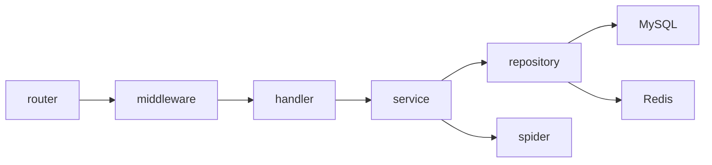
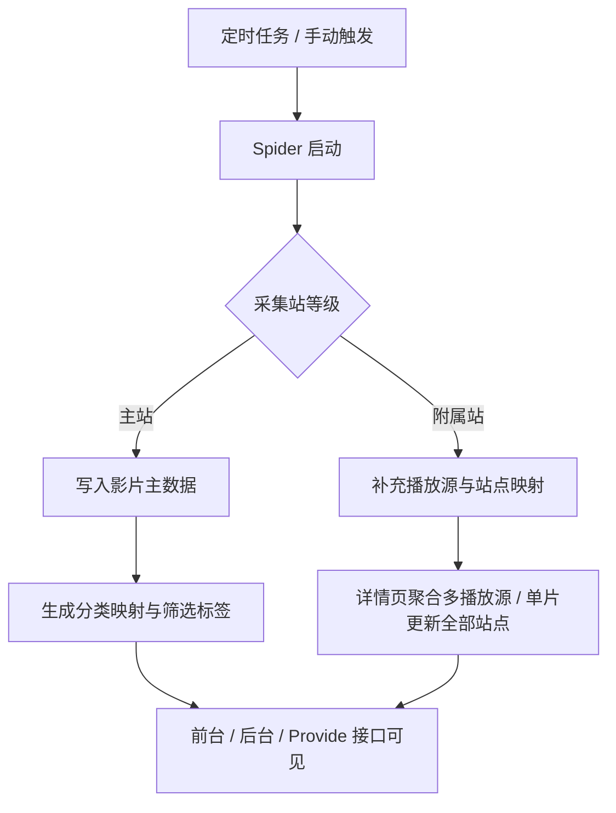

# Server

`server/` 是 EcoHub 的 Go 服务端，负责：

- 采集源管理与数据采集
- 影片检索、详情聚合、播放源聚合
- 分类映射与联动筛选
- 管理后台接口
- TVBox / MacCMS 兼容接口
- 登录态与后台鉴权

## 服务端架构



## 运行要求

- Go 1.24+
- MySQL 8+
- Redis 7+

## 启动

### 1. 准备环境变量

```bash
cd server
cp .env.example .env
```

按你的实际环境修改 `server/.env`。

常见示例：

```env
PORT=8080
JWT_SECRET=change_me_to_a_long_random_string

MYSQL_HOST=127.0.0.1
MYSQL_PORT=3306
MYSQL_USER=eco
MYSQL_PASSWORD=your_mysql_password
MYSQL_DBNAME=eco

REDIS_HOST=127.0.0.1
REDIS_PORT=6379
REDIS_PASSWORD=your_redis_password
REDIS_DB=0
```

如果 MySQL / Redis 不在当前机器上，请把 `MYSQL_HOST` / `REDIS_HOST` 改成真实可访问地址。

### 2. 启动服务

```bash
cd server
go run ./cmd/server
```

服务启动时会自动加载当前目录下的 `server/.env`。

### 3. 启动成功后

- 服务监听端口由 `PORT` 决定，默认是 `8080`
- 首次启动会初始化数据库表、默认站点配置和内置账号
- 如果数据库或 Redis 不可达，服务会在启动阶段报错退出

## 环境变量

运行 `server` 时，服务会自动读取 `server/.env`。

- `PORT`：服务监听端口，默认 `8080`
- `JWT_SECRET`：JWT 签名密钥，必须填写随机高强度值，可用 `openssl rand -hex 32` 生成
- `MYSQL_HOST` / `REDIS_HOST`：填运行 `server` 时实际能访问到的地址
- `MYSQL_PORT` / `REDIS_PORT`：填数据库和 Redis 的真实端口
- `MYSQL_USER` / `MYSQL_PASSWORD` / `MYSQL_DBNAME`：填数据库真实账号、密码和库名
- `REDIS_PASSWORD`：如果 Redis 未设置密码，可留空
- `REDIS_DB`：一般保持 `0`

生成 `JWT_SECRET`：

```bash
openssl rand -hex 32
```

| 变量 | 必填 | 说明 |
| --- | --- | --- |
| `PORT` | 是 | 服务监听端口 |
| `JWT_SECRET` | 是 | JWT 签名密钥，未配置会启动失败，可用 `openssl rand -hex 32` 生成 |
| `MYSQL_HOST` | 是 | MySQL 地址 |
| `MYSQL_PORT` | 是 | MySQL 端口 |
| `MYSQL_USER` | 是 | MySQL 用户 |
| `MYSQL_PASSWORD` | 否 | MySQL 密码 |
| `MYSQL_DBNAME` | 是 | 业务库名 |
| `REDIS_HOST` | 是 | Redis 地址 |
| `REDIS_PORT` | 是 | Redis 端口 |
| `REDIS_PASSWORD` | 否 | Redis 密码 |
| `REDIS_DB` | 否 | Redis DB，默认 `0` |

常见配置：

1. MySQL / Redis 都在当前机器上

```env
MYSQL_HOST=127.0.0.1
REDIS_HOST=127.0.0.1
```

2. MySQL / Redis 在另一台服务器

```env
MYSQL_HOST=192.168.1.10
REDIS_HOST=192.168.1.11
```

3. 数据库和 Redis 在其他开发环境或云服务

- 把 `MYSQL_HOST` / `REDIS_HOST` 改成对应域名、内网地址或公网地址
- 同时确认防火墙、白名单和数据库账号授权已经放通

## 启动后初始化

服务启动后会按当前数据库状态执行这些初始化逻辑：

- 等待 Redis 和 MySQL 可用
- 首次启动时建表；常规重启时执行 `AutoMigrate`
- 启动阶段清理项目自身缓存
- 初始化映射引擎、标准大类和分类缓存
- 初始化内置账号、基础站点配置和默认轮播图
- 初始化默认采集源和定时任务
- 执行统一重建，刷新分类、筛选、首页和开放接口所需数据
- 启动 cron 调度器

需要注意：

- 已存在的旧数据结构如果和当前实现不一致，仍需要额外做一次清理或调整

当前代码会自动补齐两个内置账号：

| 类型 | 账号 | 密码 | 权限 |
| --- | --- | --- | --- |
| 管理员 | `admin` | `admin` | 可读可写 |
| 访客 | `guest` | `guest` | 只读 |

这些默认账号仅用于初始化或演示环境。对外使用前应立即修改密码，或直接替换为你自己的账号体系。

## 采集与聚合逻辑



当前实现有几个关键约束：

- 任意时刻只允许一个主站
- 站点升级为主站时，会自动降级旧主站
- 主站变更或主站 URI 变更时，会停止采集任务并清空主数据，再由新主站重建
- 内容归并优先使用豆瓣 ID，没有豆瓣 ID 时使用片名哈希
- 附属站会采集并持久化播放列表
- 系统支持后台按同一影片触发多个站点的同步更新

## 分类、筛选与排序语义

当前公共分类搜索和 TVBox 列表接口共用同一套查询语义，避免两套逻辑长期漂移。

### 分类重建

- 分类树变更、主站切换、初始化完成后，会统一重建分类与筛选结果
- 重建时会优先保留来源分类语义，减少历史分类污染

### 筛选标签

- 类型、剧情、地区、语言、年份、排序都由后端统一生成
- 剧情、地区、语言、年份四类标签支持“其他”
- “其他”会按实际影片数据决定是否显示

### 排序定义

- 最近更新
- 人气
- 评分
- 时间

其中最近更新现在只反映主站资源更新时间，不再受附属播放源同步影响。

## 缓存与失效

当前缓存策略的目标是“只清项目自己的数据，同时把页面结果统一收敛”。

- 服务启动时会清理项目自身缓存
- 不会误删同一缓存实例中的其它服务数据
- 分类重建、主站切换后会主动刷新分类、筛选、首页和开放接口相关缓存

如果你修改了分类、主站或采集数据，但接口仍返回旧结果，优先检查是否是旧实例未重启，或历史缓存尚未刷新。

## 接口分组

### 公共接口

这类接口不要求登录：

- `/api/index`
- `/api/navCategory`
- `/api/filmDetail`
- `/api/filmPlayInfo`
- `/api/searchFilm`
- `/api/filmClassify`
- `/api/filmClassifySearch`
- `/api/proxy/video`
- `/api/config/basic`
- `/api/provide/vod`
- `/api/provide/config`

### 登录相关接口

- `POST /api/login`
- `POST /api/logout`

其中 `/api/logout` 需要已登录。

### 后台接口

`/api/manage/*` 全部挂载了鉴权中间件，覆盖这些模块：

- 首页概览
- 站点配置
- 轮播管理
- 用户管理
- 采集源与失败记录
- 定时任务
- Spider 操作
- 影片管理
- 文件管理

## 鉴权模型

当前后台鉴权流程如下：

1. `POST /api/login` 登录成功
2. 后端下发 `HttpOnly` cookie：`ecohub_auth_token`
3. `/api/manage/*` 和 `/api/logout` 由后端中间件校验 cookie 中的 JWT
4. JWT 通过后，还会继续校验 Redis 中保存的当前有效 token
5. JWT 已过期但 Redis 中 token 仍有效时，会自动刷新 cookie

这意味着：

- 前端不维护 localStorage token
- 后端是唯一真实鉴权边界
- 账号在其他设备重新登录后，旧 token 会失效
- 访客账号可以读，但写操作会被 `WriteAccess` 拦截

## 主要目录

```text
server/
├── cmd/server/             # 入口
├── internal/config/        # 配置与常量
├── internal/router/        # 路由
├── internal/middleware/    # CORS / JWT
├── internal/handler/       # HTTP 处理层
├── internal/service/       # 业务逻辑
├── internal/repository/    # 数据访问层
├── internal/model/         # 数据模型与 DTO
├── internal/spider/        # 采集与转换
├── internal/infra/db/      # MySQL / Redis 初始化
└── internal/utils/         # 工具函数
```

## 常用开发命令

```bash
cd server
go test ./...
```

如果本地 Go 缓存目录受限，可显式指定：

```bash
cd server
GOCACHE=/tmp/ecohub-go-cache go test ./...
```

## 相关文档

- [根目录说明](../README.md)
- [前端说明](../web/README.md)
- [Docker 部署说明](../README-Docker.md)
- [FAQ 与排障](../README-FAQ.md)
