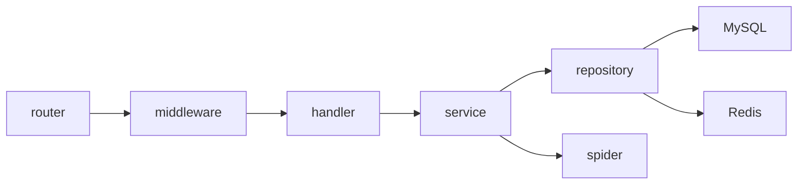
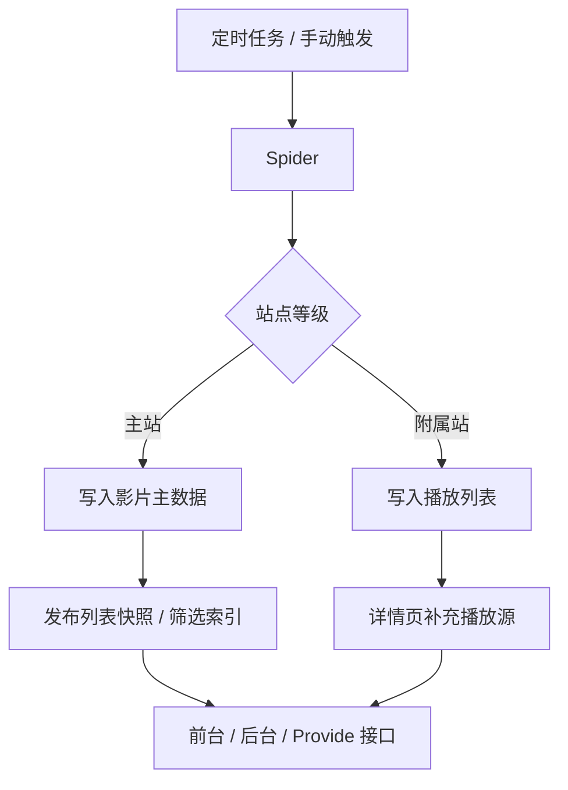
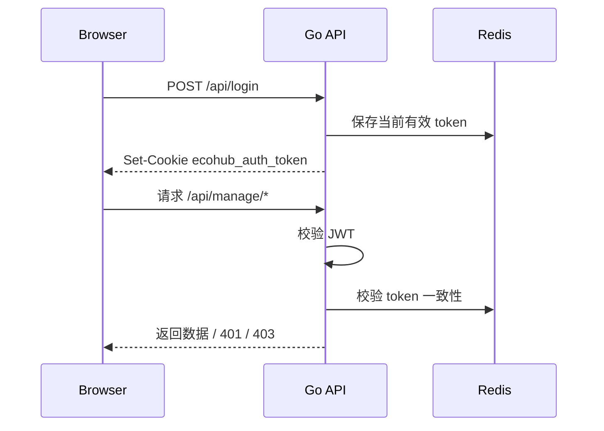

# Server

`server/` 是 EcoHub 的 Go API 服务，负责采集、归并、列表快照、缓存、开放接口和后台鉴权。

## 职责边界

- 采集源管理与 Spider 调度。
- 主站影片主数据入库。
- 附属站播放列表补源。
- 影片搜索、详情聚合、播放源聚合。
- 分类映射、筛选标签、列表快照和倒排索引。
- 管理后台 API、登录态、访客只读权限。
- TVBox / MacCMS 兼容接口。

## 架构概览


```mermaid
flowchart LR
    Router["router"] --> Middleware["middleware"]
    Middleware --> Handler["handler"]
    Handler --> Service["service"]
    Service --> Repo["repository"]
    Service --> Spider["spider"]
    Repo --> MySQL["MySQL"]
    Repo --> Redis["Redis"]
```

## 运行要求

- Go 1.24+
- MySQL 8+
- Redis 7+

## 本地启动

### 1. 准备环境变量

```bash
cd server
cp .env.example .env
```

最小配置示例：

```env
PORT=8080
JWT_SECRET=change_me_to_a_long_random_string

MYSQL_HOST=127.0.0.1
MYSQL_PORT=3306
MYSQL_USER=eco
MYSQL_PASSWORD=your_mysql_password
MYSQL_DBNAME=eco

REDIS_HOST=127.0.0.1
REDIS_PORT=6379
REDIS_PASSWORD=your_redis_password
REDIS_DB=0
```

`JWT_SECRET` 必须使用高强度随机值，可用下面命令生成：

```bash
openssl rand -hex 32
```

### 2. 启动服务

```bash
cd server
go run ./cmd/server
```

服务启动时会自动读取 `server/.env`。

### 3. 启动结果

- API 默认监听 `8080`，由 `PORT` 决定。
- 启动阶段会连接 MySQL 和 Redis，不可达会直接退出。
- 首次启动会自动建表、初始化基础配置、默认站点、内置账号和定时任务。

## 环境变量

本地 `go run` 使用 `server/.env`（见 [server/.env.example](./.env.example)）。Docker / 1Panel 使用仓库根目录 [.env.example](../.env.example)；compose 会把 `SERVER_PORT` 注入为进程内的 `PORT`。

### 服务与鉴权

| 变量 | 必填 | 默认 | 说明 |
| --- | --- | --- | --- |
| `PORT` | 是 | 无 | API 监听端口；未设置启动 panic。Docker 发布版由 compose 的 `SERVER_PORT`（默认 `8080`）注入 |
| `JWT_SECRET` | 是 | 无 | JWT 签名密钥；未设置启动 panic。生产必须用高强度随机串 |

### MySQL

| 变量 | 必填 | 默认 | 说明 |
| --- | --- | --- | --- |
| `MYSQL_HOST` | 是 | 无 | 主机；本机 `127.0.0.1`，Compose 内置库 `mysql`，容器访宿主机 `host.docker.internal` |
| `MYSQL_PORT` | 是 | 无 | 端口，通常 `3306` |
| `MYSQL_USER` | 是 | 无 | 用户名 |
| `MYSQL_PASSWORD` | 否 | 空 | 密码；空密码仅适合本地无鉴权实例 |
| `MYSQL_DBNAME` | 是 | 无 | 业务库名 |

`MYSQL_HOST` / `MYSQL_PORT` / `MYSQL_USER` / `MYSQL_DBNAME` 任一为空会启动 panic。

### Redis

| 变量 | 必填 | 默认 | 说明 |
| --- | --- | --- | --- |
| `REDIS_HOST` | 是 | 无 | 主机；本机 `127.0.0.1`，Compose 内置 `redis` |
| `REDIS_PORT` | 是 | 无 | 端口，通常 `6379` |
| `REDIS_PASSWORD` | 否 | 空 | 密码；无密码可留空 |
| `REDIS_DB` | 否 | `0` | DB 编号；非数字时忽略并保持默认 |

`REDIS_HOST` / `REDIS_PORT` 为空会启动 panic。

### 采集档位

| 变量 | 必填 | 默认 | 说明 |
| --- | --- | --- | --- |
| `COLLECT_PROFILE` | 否 | `auto` | 采集写阀与并发档位：`auto` / `light` / `standard` / `high` |

- `auto` 或未设置：按 CPU 核数自动选档（≤2 → `light`，3–7 → `standard`，≥8 → `high`）
- `light`：保守（约 2C2G）
- `standard`：中档
- `high`：高并发（约 8C+）
- 非法值会打日志并回退自动选档
- 写阀、分页 worker、源站并发等由档位内置表决定，**无需**再配其它采集并发环境变量

### Telegram 与代理（可选）

Bot Token / Chat ID / 路由策略在**管理后台**配置，不通过环境变量。进程环境仅控制出网代理（发送时读取，优先级从上到下）：

| 变量 | 必填 | 说明 |
| --- | --- | --- |
| `TG_PROXY` | 否 | Telegram **专用**代理，优先于通用代理；支持 `http://` / `https://` / `socks5://` / `socks5h://` |
| `HTTPS_PROXY` / `https_proxy` | 否 | 通用 HTTPS 代理（Telegram 次选） |
| `HTTP_PROXY` / `http_proxy` | 否 | 通用 HTTP 代理 |
| `ALL_PROXY` / `all_proxy` | 否 | 全局代理兜底 |

示例：

```env
# 本机 Clash / V2Ray
TG_PROXY=http://127.0.0.1:7890
# 或
TG_PROXY=socks5://127.0.0.1:7891

# Docker 内访问宿主机代理（发布版 / 源码版 compose 已配 host.docker.internal）
# TG_PROXY=http://host.docker.internal:7890
```

国内直连 `api.telegram.org` 常超时，建议至少配置 `TG_PROXY`。`HTTPS_PROXY` 等也会影响其它依赖系统代理的出站（若业务侧使用）；Telegram 客户端明确按上表解析。

### Docker 根目录变量对照（非 server 进程直接读取）

发布版 / 源码版 compose 还使用下列变量，**注入或映射**到容器，与 `server` 进程内变量对应关系：

| 根目录 `.env` | 作用 |
| --- | --- |
| `WEB_PORT` | 宿主机暴露 Web（Next）访问端口，默认 `3000` |
| `SERVER_PORT` | 宿主机暴露 API 直连端口，默认 `18080`（映射到容器内 8080） |
| `MYSQL_ROOT_PASSWORD` | 仅内置 MySQL 容器初始化用，**不是** server 读取项 |
| `CLUSTER_ROLE` | 集群角色：`master`（默认，负责后台与定时任务）或 `worker`（从属读节点，禁用定时任务） |
| `JWT_SECRET` / `MYSQL_*` / `REDIS_*` / `TG_PROXY` / `COLLECT_PROFILE` 等 | 通过 compose `environment` 直接注入 server（或 All-in-One）进程 |

完整部署说明见 [部署指南](../docs/README-Deploy.md)。

### 地址写法小结

- 本机开发：`127.0.0.1`
- 其它机器：内网 IP / 域名
- Compose 服务名：`mysql`、`redis`
- 容器访问宿主机：`host.docker.internal`

## 启动初始化

服务启动后会执行这些初始化动作：

- 等待 MySQL 和 Redis 可用。
- 执行 `AutoMigrate`。
- 清理项目自身缓存。
- 初始化映射引擎、标准大类、分类缓存。
- 初始化内置账号、基础站点配置、默认轮播图。
- 初始化默认采集源和定时任务。
- 加载或构建前台列表快照、筛选项和读模型。
- 启动 cron 调度器。

## 采集模型


```mermaid
flowchart TD
    Trigger["定时任务 / 手动触发"] --> Spider["Spider"]
    Spider --> Level{"站点等级"}
    Level -->|主站| Master["写入影片主数据"]
    Level -->|附属站| Slave["写入播放列表"]
    Master --> Snapshot["发布列表快照 / 筛选索引"]
    Slave --> Aggregate["详情页补充播放源"]
    Snapshot --> PublicAPI["前台 / 后台 / Provide 接口"]
    Aggregate --> PublicAPI
```

核心约束：

- 任意时刻只允许一个主站。
- 主站负责影片主数据和检索入口。
- 附属站只补充播放列表。
- **主站身份键**（`film_index.content_key`）：优先 `vod_{源站vod_id}`，无 ID 时回退 `name_{hash}`。
- **跨站匹配**（`movie_match_key`）：优先豆瓣身份，其次规范化片名，用于附属站播放源对齐。
- 主站切换或主站 URI 变更会停止采集并重建主数据。
- 后台支持对单部影片触发全部站点更新。

## 快照与缓存

前台列表不直接扫描采集中的临时状态，而是读取发布后的快照和读模型：

- `film_index` 保存影片检索入口。
- `film_list_snapshot` 保存前台列表快照。
- `film_filter_index_snapshot` 保存筛选倒排索引。
- 活跃快照版本记录在 Redis。
- 增量发布按 affected mids 分批处理数据库 SQL，事务成功后一次性刷新内存读模型。

缓存策略：

- 服务启动时只清理 EcoHub 自身缓存。
- 分类重建、主站切换、快照发布后会刷新相关缓存。
- 首页、筛选配置、TVBox 列表会跟随快照发布收敛。

## 分类、筛选与排序

公共分类搜索、后台列表和 TVBox 列表使用同一套后端语义：

- 分类优先使用来源分类映射。
- 剧情、地区、语言、年份支持“其他”。
- 排序包含最近更新、人气、评分、时间。
- 最近更新只看主站资源更新时间，不受附属播放源同步影响。

## 接口分组

公共接口：

- `/api/index`
- `/api/navCategory`
- `/api/filmDetail`
- `/api/filmPlayInfo`
- `/api/searchFilm`
- `/api/filmClassify`
- `/api/filmClassifySearch`
- `/api/proxy/video`
- `/api/config/basic`
- `/api/provide/vod`
- `/api/provide/config`

登录接口：

- `POST /api/login`
- `POST /api/logout`

后台接口：

- `/api/manage/*`

后台接口覆盖首页概览、站点配置、轮播、用户、采集源、失败记录、定时任务、Spider 操作、影片管理和文件管理。

## 鉴权模型


```mermaid
sequenceDiagram
    participant Browser
    participant API as Go API
    participant Redis

    Browser->>API: POST /api/login
    API->>Redis: 保存当前有效 token
    API-->>Browser: Set-Cookie ecohub_auth_token
    Browser->>API: 请求 /api/manage/*
    API->>API: 校验 JWT
    API->>Redis: 校验 token 一致性
    API-->>Browser: 返回数据 / 401 / 403
```

- 登录态使用 `HttpOnly` cookie：`ecohub_auth_token`。
- 后端是最终鉴权边界。
- `/api/manage/*` 和 `/api/logout` 会校验 JWT 与 Redis 中的当前 token。
- JWT 过期但 Redis token 仍有效时，会自动刷新 cookie。
- 访客账号可以读取后台数据，写操作会被 `WriteAccess` 拦截。

## 默认账号

| 类型 | 账号 | 密码 | 权限 |
| --- | --- | --- | --- |
| 管理员 | `admin` | `admin` | 可读可写 |
| 访客 | `guest` | `guest` | 只读 |

默认账号仅适合初始化和演示。对外部署后请立即修改密码。

## 主要目录

```text
server/
├── cmd/server/             # 入口
├── internal/config/        # 配置与常量
├── internal/router/        # 路由
├── internal/middleware/    # CORS / JWT / 写权限
├── internal/handler/       # HTTP 处理层
├── internal/service/       # 业务逻辑
├── internal/repository/    # 数据访问层
├── internal/model/         # 数据模型与 DTO
├── internal/spider/        # 采集与转换
├── internal/infra/db/      # MySQL / Redis 初始化
└── internal/utils/         # 工具函数
```

## 常用命令

```bash
cd server
go run ./cmd/server
go test ./...
```

如果本地 Go 缓存目录受限：

```bash
cd server
GOCACHE=/tmp/ecohub-go-cache go test ./...
```

## 相关文档

- [根目录总览](../README.md)
- [前端说明](../web/README.md)
- [部署指南](../docs/README-Deploy.md)
- [FAQ 与排障](../docs/README-FAQ.md)
- [版本变更](../docs/RELEASE.md)
- [Telegram 通知行为](./notify.md)
